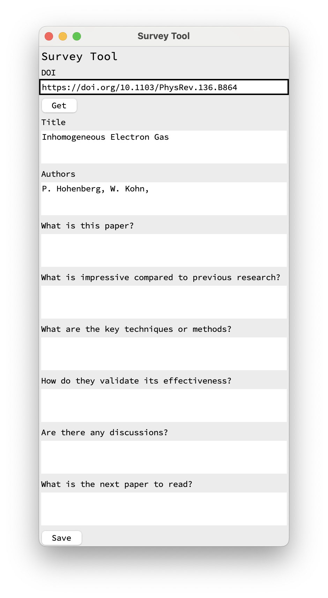

# Survey Tool
A simple GUI tool to summarize the contents of a paper.

## Screenshot


## Feature
- The title and author's name can be retrieved from DOI.
- The entered text can be saved as a Markdown file.

## Require
- Python 3

- Crossref API
```
pip install crossrefapi
```

## Usage
1. Start
```
./main.py &
```
2. Enter DOI :arrow_right: Get Button
3. Enter text :arrow_right: Save Button

- The output file is saved in `./data`
